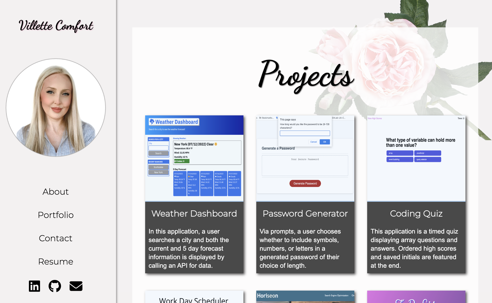

# React Portfolio

## Application Description
The application is deployed on both Vercel and GitHub. While working on the code as a developer, it is viewed by using 'npm start' in the terminal command. The website has 4 pages: About, Contact, Portfolio and Resume. They all have a fixed Sidebar component, which furthermore has a Navigation component inside. The Portfolio page also renders a Projects component. The navigation includes Font Awesome icons, and the pages all use imports from Google Fonts. The contact form uses Email.js to send me the message, and Toastify to alert the user of email success.

## Languages & Tech Stack
- HTML
- CSS
- JavaScript
- React
- Toastify alerts
- Email.js contact form
- Font Awesome
- Google Fonts

## Links
* [Deployment](https://villette.vercel.app)
* [Repository](https://github.com/villettec/Portfolio-React)

## Screenshots
